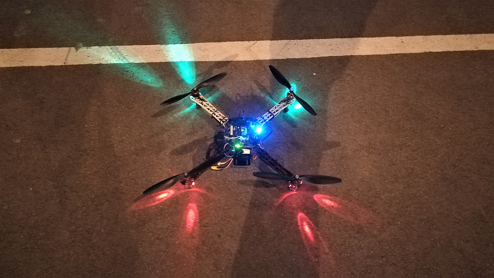
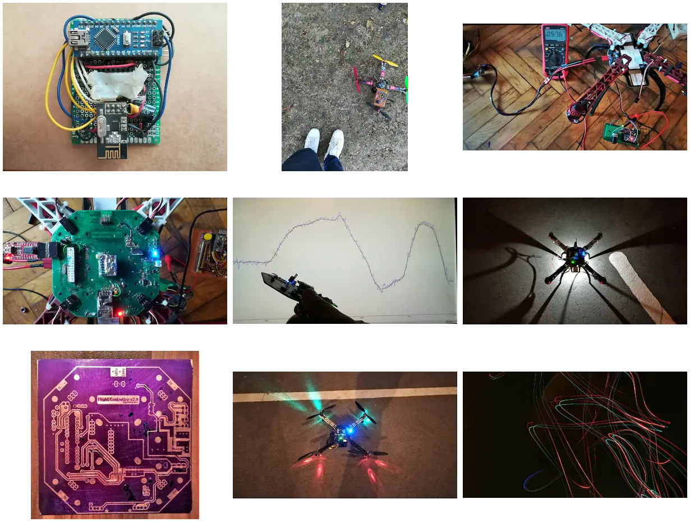

# 8bit-quad

Firmware for a custom-built quadcopter based on the ATmega328 microcontroller.

The project implements the complete flight controller firmware, including attitude estimation, stabilization, PID control and radio communication. It was designed around a resource-constrained 8-bit MCU and uses a simple sequential execution model.



This revision (2021-03) is a rebrand/cleanup pass on top of the earliest
surviving version: a working nRF24L01+-linked flight controller and matching
remote transmitter, running on the custom "8bit-quad" ATmega328 board pair.
It flies in `acro` and `stabilize` (angle-hold) modes.

## Features

- Attitude estimation (Mahony sensor fusion)
- Acro and stabilize (angle-hold) flight modes
- Cascaded PID control (outer angle loop, inner rate loop)
- nRF24L01+ radio link with a custom command/telemetry/setting packet protocol
- Multiple selectable telemetry payloads (regulation, IMU, motors)
- Runtime-configurable settings persisted to EEPROM
- EEPROM black-box logging of battery voltage/current
- Battery voltage monitoring with a low/warning/error status ladder
- Failsafe on radio-link timeout (throttle cut)

## Hardware

### Flight controller

- MCU: ATmega328
- Framework: Arduino (custom core, see `hardware/`)
- IMU: MPU9255
- Radio: nRF24L01+


### Remote controller

Custom ATmega328 transmitter board, nRF24L01+ radio, serial command interface
for configuration over USB/UART. This is 2018 code, written alongside the
first flight controller revision and never modified afterwards; it shares the
wire protocol byte-for-byte (see `doc/changelog.md`).

## Flight controller implementation

Single-threaded, fixed-period main loop (no RTOS/scheduler): a busy-wait
keeps the loop cycling at a fixed period, subdivided into sub-cycles so that
slower tasks (radio servicing, battery read, altitude/pressure read,
indication LEDs) each run on their own sub-cycle instead of every iteration.

- **Sensor reading**: IMU (gyro + accel) read every cycle; barometer read on
  a slower sub-cycle for altitude.
- **Sensor fusion**: Mahony filter (gyro + accel only, no magnetometer),
  producing a quaternion converted to pitch/roll/yaw.
- **Attitude representation**: Euler pitch/roll from the fusion output; yaw
  rate obtained by differentiating the fused yaw angle.
- **Stabilization**: cascaded PID - an outer angle loop (pitch/roll) feeds
  setpoints to an inner rate loop (pitch/roll/yaw), which drives the motor
  mix. `acro` mode drives the rate loop directly from the sticks, skipping
  the angle loop.
- **Motor mix**: quad-X mix, clamped, written straight to the timer compare
  registers (`OCR0A/B`, `OCR1A/B`) - no ESC command protocol, just PWM duty
  cycle.
- **Communication**: nRF24L01+ packets (`Command`/`Setting`/`Telemetry*`)
  drained once per outer cycle; a link timeout zeroes the stick inputs and
  disarms.
- **Altitude**: BMP280 pressure → relative altitude, reported over telemetry.
  No altitude-hold in this revision (see `doc/changelog.md`).

This revision reorganizes and retunes the previous one rather than adding
major features - see `doc/changelog.md` for the detailed changes.

## Development environment

- Arduino IDE (or `arduino-cli`)
- Custom Arduino core, see `hardware/` and the Building section below
- Libraries vendored inside the core, under
  `hardware/8bit-quad/avr/libraries/` (RF24, MPU6050, MPU925x_I2C,
  MahonyAHRS, UART_atmega328, and a BMP280 driver) - some of these are no
  longer distributed through Arduino's Library Manager, so they're frozen
  here rather than assumed to be installed

### Building

This uses a custom Arduino core, so it won't show up under a stock
"Arduino Uno" board.

**Boards Manager (recommended):**

1. In Arduino IDE **File > Preferences > Additional boards manager URLs**,
   add:
   `https://raw.githubusercontent.com/VasilKalchev/8bit-quad/main/package_8bit-quad_index.json`
2. Install "8bit-quad AVR Boards" from **Tools > Board > Boards Manager**.

The package is the core with the vendored libraries inside it, so there is
nothing else to install.

**This revision needs core `1.0.0`.** Boards Manager offers more than one
version; they carry different sets of vendored libraries, and a core meant for
another revision will not necessarily compile this one. The version is in
`hardware/8bit-quad/avr/platform.txt`, which is the same line
`hardware/package.sh` reads when it builds the archive.

`arduino-cli` can pin it for you. Each sketch carries a `sketch.yaml` naming
this revision's core, so

```sh
arduino-cli compile --profile fc
arduino-cli compile --profile rc
```

fetches exactly that core and builds against it with nothing installed
beforehand.

Core `1.0.0` is the nearest published core to this revision rather than an
exact match: it carries the `MPU925x_I2C` 1000 us read timeout that this
revision predates, so `fc` builds 42 bytes smaller than it does against the
core in this repository. For a build identical to this revision, use the
manual route below.

**Manual:**

The repo is already laid out as an Arduino sketchbook (`hardware/8bit-quad`),
so point **File > Preferences > Sketchbook location** at this repo and
restart. Nothing needs copying. The IDE only auto-detects `hardware/` inside
the sketchbook location, so having it next to the sketch isn't enough on its
own.

Either way, an "8bit-quad" section appears under **Tools > Board** with
`8bit-quad_fc` and `8bit-quad_rc` entries. Open
`fw/8bit-quad-fc/8bit-quad-fc.ino` (or `fw/8bit-quad-rc/8bit-quad-rc.ino`)
with File > Open, select the matching board, and build/upload as usual. The
sketches live under `fw/`, so they won't appear in the Sketchbook menu.

To cut a new release of the core, run `hardware/package.sh` and put the
checksum and size it prints into `package_8bit-quad_index.json`, then attach
the archive to a `hardware-v<version>` release.

## Repository

This repository was reconstructed retroactively from archived development
snapshots that originally existed as standalone project folders.

The snapshots have been converted into Git commits representing the
development timeline. Abandoned development paths have been preserved as Git
branches.

The detailed reconstruction history and version changes are documented in:

- [`/doc/changelog.md`](doc/changelog.md)
- [`/doc/history.md`](doc/history.md)

Every revision is tagged with its date, `fw-2018.05.04` through
`fw-2022.04.03`. The firmware was never versioned while it was being written,
so the dates are all there is. The Arduino core is versioned separately, as
`hardware-v1.0.0` and `hardware-v1.1.0`.

## Gallery

The [`/gallery/`](gallery/) directory contains photos documenting the hardware and
development process.

[](gallery/)


Videos:

- [First flights (pre 2018)](https://youtu.be/U1KzGiQBYQM)
- [Etching the flight controller PCB](https://youtu.be/nzKjSb2GAe4)
- [Ground view while flying](https://youtu.be/9E8ZXUsTuo8)

## Related repositories

- [`8bit-quad.hw`](https://github.com/VasilKalchev/8bit-quad.hw) - the
  `8bit-quad-fc` board design. The remote never had one, it was hand wired on
  protoboard.
