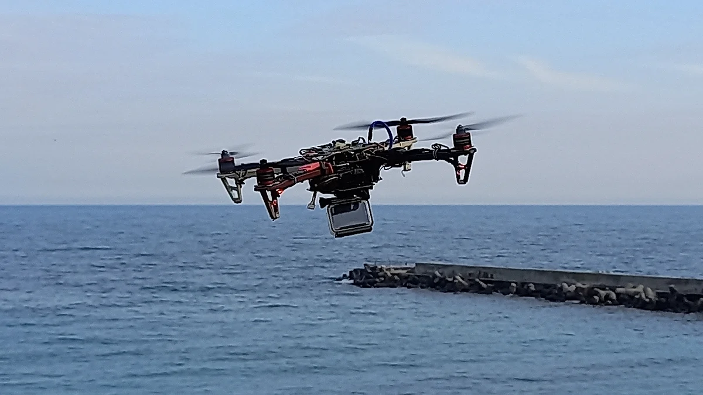

# 8bit-quad

Firmware for a custom-built quadcopter based on the ATmega328 microcontroller.

The project implements the complete flight controller firmware, including attitude estimation, stabilization, PID control and radio communication. It was designed around a resource-constrained 8-bit MCU and uses a simple sequential execution model.



This revision (2022-04) is the last one that flew. It takes its commands
from a standard PPM receiver, runs an MPU6050 with Mahony fusion, and flies
in `acro` and `stabilize` (angle-hold) modes.

Earlier commits carry the nRF24L01+ revisions and the matching custom remote
transmitter, which this one retires - see `doc/changelog.md`.

## Features

- Attitude estimation (Mahony sensor fusion)
- Acro and stabilize (angle-hold) flight modes
- Cascaded PID control (outer angle loop, inner rate loop)
- Standard PPM receiver input, 8 channels
- Flight mode, lights and calibration selected from the transmitter's
  switches, with the potentiometers supplying values
- Accelerometer and gyro offset trimming from the air
- PID gains persisted to EEPROM
- Battery voltage monitoring with a low/warning/error status ladder

## Hardware

### Flight controller

- MCU: ATmega328
- Framework: Arduino (custom core, see `hardware/`)
- IMU: MPU6050 (MPU9255 also supported, selected at compile time)
- Receiver: any PPM receiver, signal on `D2`


## Flight controller implementation

Single-threaded, fixed-period main loop (no RTOS/scheduler): a busy-wait
keeps the loop cycling at a fixed period, subdivided into sub-cycles so that
slower tasks (receiver read, battery read, indication LEDs, quaternion
conversion, angle controller) each run on their own sub-cycle instead of
every iteration.

- **Sensor reading**: IMU (gyro + accel) read every cycle, with zero-reads
  and I2C failures counted rather than ignored.
- **Sensor fusion**: Mahony filter (gyro + accel only, no magnetometer),
  producing a quaternion converted to pitch/roll. A complementary filter is
  available as a compile-time alternative.
- **Attitude representation**: Euler pitch/roll from the fusion output; yaw
  rate taken directly from the gyro.
- **Stabilization**: cascaded PID - an outer angle loop (pitch/roll) feeds
  setpoints to an inner rate loop (pitch/roll/yaw), which drives the motor
  mix. `acro` mode drives the rate loop directly from the sticks, skipping
  the angle loop.
- **Motor mix**: quad-X mix, clamped, written straight to the timer compare
  registers (`OCR0A/B`, `OCR1A/B`) - no ESC command protocol, just PWM duty
  cycle.
- **Receiver**: one PPM stream carries four sticks, four switches encoded
  across two channels, and two potentiometers. The switch combination
  selects flight mode and the configuration or calibration to apply.

## Development environment

- Arduino IDE (or `arduino-cli`)
- Custom Arduino core, see `hardware/` and the Building section below
- Libraries vendored inside the core, under
  `hardware/8bit-quad/avr/libraries/` (MPU6050, MPU925x_I2C,
  UART_atmega328) - these are no longer distributed through Arduino's
  Library Manager, or carry local edits, so they're frozen here rather than
  assumed to be installed. `PPMReader` is vendored inside the sketch instead,
  since it is GPL-3.0.

### Building

This uses a custom Arduino core, so it won't show up under a stock
"Arduino Uno" board.

**Boards Manager (recommended):**

1. In Arduino IDE **File > Preferences > Additional boards manager URLs**,
   add:
   `https://raw.githubusercontent.com/VasilKalchev/8bit-quad/main/package_8bit-quad_index.json`
2. Install "8bit-quad AVR Boards" from **Tools > Board > Boards Manager**.

The package is the core with the vendored libraries inside it, so there is
nothing else to install.

**This revision needs core `1.1.0`.** Boards Manager offers more than one
version; they carry different sets of vendored libraries, and a core meant for
another revision will not necessarily compile this one. The version is in
`hardware/8bit-quad/avr/platform.txt`, which is the same line
`hardware/package.sh` reads when it builds the archive.

`arduino-cli` can pin it for you. Each sketch carries a `sketch.yaml` naming
this revision's core, so

```sh
arduino-cli compile --profile fc
```

fetches exactly that core and builds against it with nothing installed
beforehand.

**Manual:**

The repo is already laid out as an Arduino sketchbook (`hardware/8bit-quad`),
so point **File > Preferences > Sketchbook location** at this repo and
restart. Nothing needs copying. The IDE only auto-detects `hardware/` inside
the sketchbook location, so having it next to the sketch isn't enough on its
own.

Either way, an "8bit-quad" section appears under **Tools > Board** with
`8bit-quad_fc` and `8bit-quad_rc` entries. Open
`fw/8bit-quad-fc/8bit-quad-fc.ino` with File > Open, select the `fc` board,
and build/upload as usual. The sketches live under `fw/`, so they won't
appear in the Sketchbook menu.

To cut a new release of the core, run `hardware/package.sh` and put the
checksum and size it prints into `package_8bit-quad_index.json`, then attach
the archive to a `hardware-v<version>` release.

## Repository

This repository was reconstructed retroactively from archived development
snapshots that originally existed as standalone project folders.

The snapshots have been converted into Git commits representing the
development timeline. Abandoned development paths have been preserved as Git
branches.

The detailed reconstruction history and version changes are documented in:

- [`/doc/changelog.md`](doc/changelog.md)
- [`/doc/history.md`](doc/history.md)

Every revision is tagged with its date, `fw-2018.05.04` through
`fw-2022.04.03`. The firmware was never versioned while it was being written,
so the dates are all there is. The Arduino core is versioned separately, as
`hardware-v1.0.0` and `hardware-v1.1.0`.

## Gallery

The [`/gallery/`](gallery/) directory contains photos documenting the hardware and
development process.

[](gallery/)


Videos:

- [First flights (pre 2018)](https://youtu.be/U1KzGiQBYQM)
- [Etching the flight controller PCB](https://youtu.be/nzKjSb2GAe4)
- [Ground view while flying](https://youtu.be/9E8ZXUsTuo8)

## Related repositories

- [`8bit-quad.hw`](https://github.com/VasilKalchev/8bit-quad.hw) - the
  `8bit-quad-fc` board design. The remote never had one, it was hand wired on
  protoboard.
