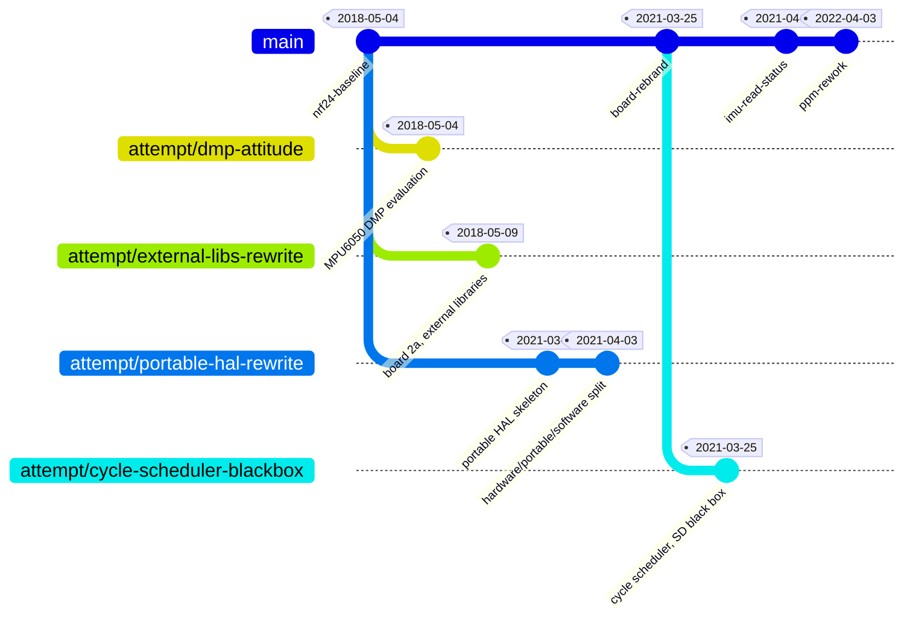

# Project history

Hardware assembly began in the summer of 2017; the earliest surviving code is
from January 2018. This document explains how the project's history was
reconstructed from several archived development snapshots that were kept as
plain folder copies, never under version control.

## How the dates were established

Three independent sources, cross-checked:

- The earliest snapshot carries its own single-commit git repository, dated
  2018-05-04.
- Two later snapshots contain zipped backups of themselves, taken 2021-03-25
  and 2022-02-27. Zip entries store per-file mtimes, so these survived the
  bulk folder copies that later rewrote the loose files' timestamps.
- Loose file mtimes survived intact in most snapshot folders. Only two were
  scrambled, and in both cases the content matches a dated zip exactly.

Content comparison settles parentage where dates can't. It has to be done with
line endings normalized: the 2018 snapshot's working tree is LF while every
other copy is CRLF, which makes identical files look different. All 32 of its
files show as modified against its own commit for that reason alone.

The milestones and branches below are named after what the code did, and the
archived snapshots are named and dated to match.

## Lineage



Only `nrf24-baseline` and `ppm-rework` are complete, working firmware.
`board-rebrand` and `imu-read-status` are working stepping stones between
them. The four `attempt/*` branches are rewrites and alternatives that were
abandoned before reaching a flyable state; none of them build, and each is
committed as found.

Three of the branches hold work older than the commit they hang off, because
no commit exists at the state they were written against.
`attempt/external-libs-rewrite` forked from the mainline of around 2018-04-10,
three and a half weeks before its parent's content.
`attempt/portable-hal-rewrite` forked around 2021-03-18, after the IMU driver
work but before the 2021-03-24 namespace rename, so it sits between the first
two commits on `main` and is attached to the first. `attempt/dmp-attitude` is
attached to `nrf24-baseline`, where the file was found parked, but its code is
a fusion generation older than that commit.

Work happened in three bursts with long gaps: 2018-01 to 2018-05, then nothing
for almost three years, 2021-03 to 2021-04, then eight months of nothing, and
2021-12 to 2022-04.

## `main` branch

- **`nrf24-baseline` (2018-05-04)** - earliest working revision. Custom board,
  nRF24L01+ link, MPU9255 + Mahony fusion, cascaded PID, altitude-hold code
  present but never engaged.
- **`board-rebrand` (2021-03-25)** - reorganization onto the "8bit-quad" board
  family structure; same core stack, retuned PID and battery filtering, a
  median filter on the pressure read, and altitude-hold dropped rather than
  carried forward. Dated by the snapshot the source was taken from; the
  namespace rename that defines it was written the day before, 2021-03-24.
  Before that date the code still used the 2018 `regulation::` and
  `pid::inner/outer` names.
- **`imu-read-status` (2021-04-03)** - the nine days after that snapshot.
  `MPU9255::getMotion()` starts reporting read failures instead of failing
  silently, the IMU offsets are recalibrated, yaw I is trimmed back, and the
  I2C clock is forced back down to 400 kHz at the register level. In the
  original source this window also disabled altitude-hold and added a
  compile-time IMU selection macro, neither of which is carried here.
- **`ppm-rework` (2021-12-20 .. 2022-04-03)** - the version that was actually
  flown, with its gains recorded in dated notes at the time that are not
  reproduced in this repository, see the note below. Switched from the
  nRF24 remote to a standard PPM receiver, which retires the transmitter and
  everything shared with it. Dropped altitude-hold and the barometer, moved
  configuration onto the RC switches, upgraded
  the rate loop to full PID with a D term, went back to the MPU6050, retimed
  the main loop and I2C clock. This is the last known-working state.

### Resolution of the 2021 rework

The whole 2021 rework ran from 2021-03-09 to 2021-04-03, under four weeks, and
only two complete states of it survive: a snapshot taken 2021-03-25 and the
folder's own end state of 2021-04-03. Those are the two commits above.
Everything else about that window comes from individual file timestamps, which
order the work but don't give recoverable trees:

```
2021-03-09  MPU9255.hpp
2021-03-15  EepromSetting.hpp
2021-03-16  MPU6050.cpp
2021-03-21  MPU9255.cpp
2021-03-23  debug.hpp
2021-03-24  config.cpp/hpp   <- the namespace rename
2021-03-25  board.cpp, main.ino, cfg.hpp   <- snapshot taken
2021-03-29  config.cpp
2021-04-02  MPU6050/MPU9255 .cpp/.hpp
2021-04-03  config.hpp
```

The split matters beyond resolution: 2021-03-25 is the exact state
`attempt/cycle-scheduler-blackbox` forked from, and it is the closest
committed parent for `attempt/portable-hal-rewrite`.

## Branches (abandoned attempts, not merged into `main`)

- **`attempt/dmp-attitude` (before 2018-05-04)** - an evaluation of the
  MPU6050's on-chip Digital Motion Processor as a replacement for filtering
  attitude on the MCU. The DMP path is fully wired, but its output is only
  printed alongside the complementary filter's for comparison, never fed to
  the controller. Found parked in the baseline snapshot as a second sketch
  with its extension changed so the IDE would ignore it, which is also why it
  is committed at that snapshot's date: the code is a fusion generation older,
  predating Mahony, and no better date survives. It does not compile against
  its parent, because every `config::` declaration it needs had been commented
  out by then.
- **`attempt/external-libs-rewrite` (2018-04-10 .. 2018-05-09)** - a rewrite
  onto board revision "2a", with the drivers and shared types extracted into
  independently installed Arduino libraries (`MAD-DataTypes`, `MAD-Utils`,
  `UART_atmega328`, included with angle brackets rather than vendored in the
  sketch). Ran in parallel with the baseline and was dropped five days after
  it. A note added to the folder in 2021, while the snapshots were being
  organized, confirms it was intended as a clean rewrite of the original.
- **`attempt/portable-hal-rewrite` (2021-03-15 .. 2021-04-03)** - a clean
  rewrite around a chip-agnostic `portable::` HAL, with each pipeline stage
  introduced by a doc comment declaring its inputs, outputs, cycles, timing
  and priority. Survives as two folders that are one continuous effort, so
  they become two commits on this branch: a bare skeleton, then a version that
  adds the `hardware`/`portable`/`software` split and wires up more stages.
  Never finished. The `portable` headers for ADC, GPIO and radio are
  zero-length files, and a GPS-fed position-hold stage exists only as a doc
  comment and a standalone `pos_ctrl` test. It forked from the 2021 rework in
  progress, after the IMU driver updates but before the 2021-03-24 namespace
  rename, so its parent is between `nrf24-baseline` and `board-rebrand` rather
  than either one exactly.
- **`attempt/cycle-scheduler-blackbox` (forked 2021-03-25)** - a categorized
  task-cycle scheduler, SD-card black-box logging and a `nav` placeholder,
  layered on the working loop. Forked from exactly the 2021-03-25 snapshot:
  its config and IMU driver files are byte-identical to the zip and none of
  the changes made over the following nine days are present. Captured
  mid-edit; doesn't compile as committed. Its own mtimes were scrambled, so it
  can only be bounded to after 2021-03-25 and before the 2021-12 restart,
  which continued from `imu-read-status` instead.

## The remote transmitter

The `rc` firmware is 2018 code, written between 2018-01-23 and 2018-04-26, and
it was never touched again. The same unmodified copy sits in both the 2021 and
2022 snapshots. Its `Communication.hpp` differs from the flight controller's
2018 copy by a trailing newline only, so the wire protocol is shared exactly.

`ppm-rework` drops the nRF24 link for a PPM receiver, so the transmitter has
nothing left to talk to and no code left in common. It is removed at that
commit rather than left in the tree as a dead half. The three earlier commits
still carry it, complete and unchanged, which is where to find it.

## What's out of scope for this repository

Physical-build flight-tuning history (specific PID gains tried, ESC firmware
versions, hardware fixes for one airframe) belonged to the tuning notes kept
alongside the `ppm-rework` snapshot and is intentionally not carried into this
repository or `doc/changelog.md`. It's specific to one physical quad, not to
the firmware's design.
